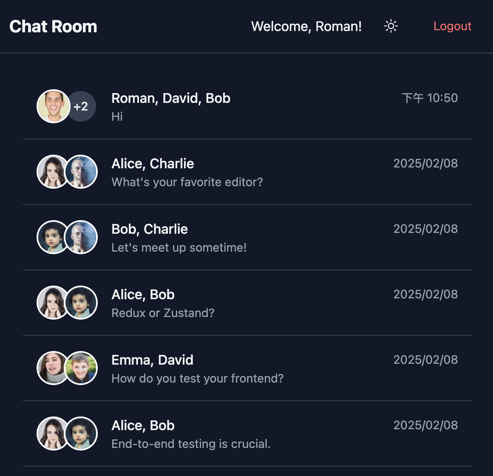

# Chatroom

A chat application demo built with React and TypeScript, featuring emoji reactions, image sharing, and dark mode support.

[Live Demo](https://rccj.github.io/chatroom)



## Features

### Current Features
- 🎭 Multiple chat rooms
- 👥 User avatars
- 🌓 Dark mode support
- 😊 Basic emoji reactions
- 📸 Image sharing
- 💾 Local storage persistence
- 📱 Responsive design

### Planned Features
- ⚡ Real-time messaging
- ⌨️ Typing indicators
- ✓ Message status
- 🎯 Enhanced reactions

## Tech Stack

- **Frontend Framework**: React 19 + TypeScript
- **Build Tool**: Vite
- **Styling**: TailwindCSS
- **State Management**: Zustand
- **Routing**: React Router
- **Code Quality**: Biome

## Getting Started

### Prerequisites
- Node.js 18+
- npm 9+

### Installation

1. Clone the repository
```bash
git clone https://github.com/rccj/chatroom.git
cd chatroom
```

2. Install dependencies
```bash
npm install
```

3. Start development server
```bash
npm run dev
```

4. Open http://localhost:5173

### Build & Deploy

```bash
# Build for production
npm run build

# Deploy to GitHub Pages
npm run deploy
```

## Project Structure

```
src/
├── api/          # API interfaces
├── components/   # Reusable components
├── hooks/        # Custom hooks
├── pages/        # Page components
├── stores/       # Zustand stores
├── types/        # TypeScript types
└── utils/        # Utility functions
```

## Current Features Detail

### Chat Interface
- Basic message sending and receiving
- Image upload support
- Emoji reactions (👍 ❤️ 😄)
- Chat history persistence using localStorage

### Dark Mode
- System preference detection
- Manual toggle
- Persistent preference

### Responsive Design
- Mobile-first approach
- Adaptive layouts
- Touch-friendly interactions

## License

MIT © [rccj](https://github.com/rccj)
